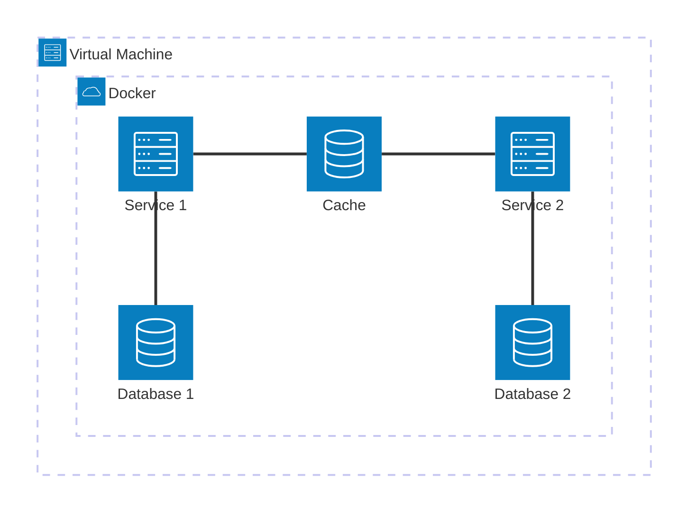
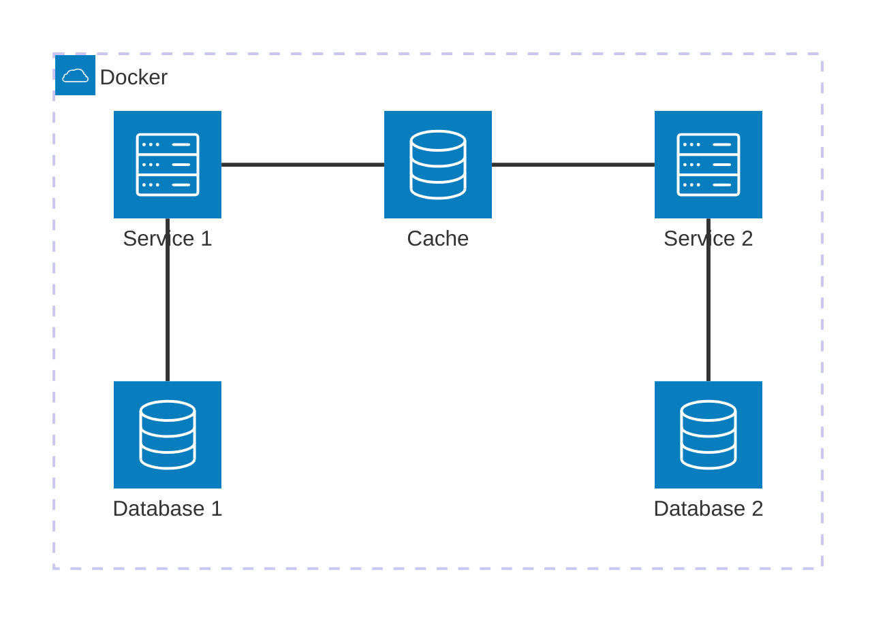

# forum-api-microservices

Forum API Microservices

## Directory Structure

* [/app](/app/) : Microservices Source Code
    * Currently we have [Auth Service](/app/auth-service/), [User Service](/app/user-service/), and [Thread Service](/app/thread-service/).
* [docker-compose.yml](docker-compose.yml) : Containerize MongoDB & Redis. Will help for development.

## Microservices Development

* You will need to copy or modify `docker-compose.yml` to ignore the deployment of microservices.
* Run Redis & MongoDB using `docker compose up -d`.
* Go to the microservice you want to update and read the README.md of each directory to understand how to run them.

## Development

* Build Images of Microservices: `docker compose build`
* Run all: `docker compose up -d`

## Software Architecture


## Vagrant Sample

### Provider - Virtual Box



### Docker without Vagrant




## License

MIT

```
MIT License

Copyright (c) 2022 Bervianto Leo Pratama's Personal Projects

Permission is hereby granted, free of charge, to any person obtaining a copy
of this software and associated documentation files (the "Software"), to deal
in the Software without restriction, including without limitation the rights
to use, copy, modify, merge, publish, distribute, sublicense, and/or sell
copies of the Software, and to permit persons to whom the Software is
furnished to do so, subject to the following conditions:

The above copyright notice and this permission notice shall be included in all
copies or substantial portions of the Software.

THE SOFTWARE IS PROVIDED "AS IS", WITHOUT WARRANTY OF ANY KIND, EXPRESS OR
IMPLIED, INCLUDING BUT NOT LIMITED TO THE WARRANTIES OF MERCHANTABILITY,
FITNESS FOR A PARTICULAR PURPOSE AND NONINFRINGEMENT. IN NO EVENT SHALL THE
AUTHORS OR COPYRIGHT HOLDERS BE LIABLE FOR ANY CLAIM, DAMAGES OR OTHER
LIABILITY, WHETHER IN AN ACTION OF CONTRACT, TORT OR OTHERWISE, ARISING FROM,
OUT OF OR IN CONNECTION WITH THE SOFTWARE OR THE USE OR OTHER DEALINGS IN THE
SOFTWARE.

```